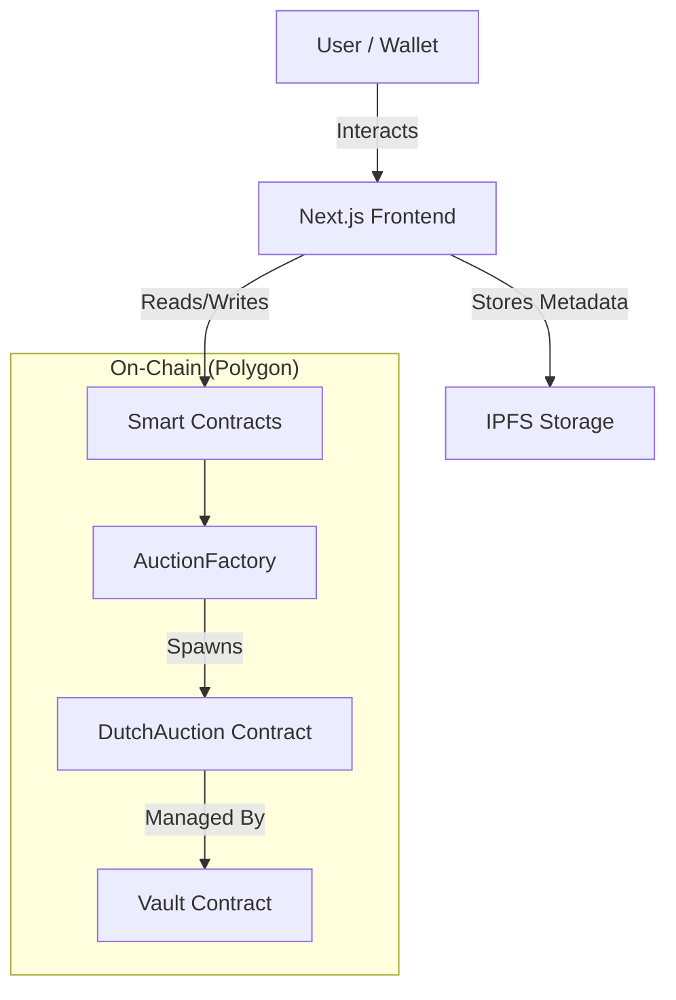

# ClearFall Protocol

<p align="center">
  
</p>

<p align="center">
  <strong>Advanced Decentralized Dutch Auction Platform on Polygon Amoy</strong>
</p>

<p align="center">
  <a href="USER_GUIDE.md">📖 User Guide</a>
  &nbsp;•&nbsp;
  <a href="https://polygon.technology/">Polygon</a>
</p>

<p align="center">
  <a href="https://polygon.technology/">
    
  </a>
  <a href="https://soliditylang.org/">
    
  </a>
  <a href="https://nextjs.org/">
    
  </a>
</p>

---

## 📑 Table of Contents

1.  [Overview](#-overview)
2.  [Why ClearFall?](#-why-clearfall)
3.  [Architecture](#-architecture)
4.  [Smart Contract System](#-smart-contract-system)
5.  [Detailed Workflow](#-detailed-workflow)
6.  [Getting Started](#-getting-started)
7.  [Technical Specifications](#-technical-specifications)
8.  [Security & Auditing](#-security--auditing)
9.  [Project Structure](#-project-structure)
10. [FAQ](#-faq)
11. [License](#-license)

---

## 🚀 Overview

**ClearFall Protocol** is a decentralized auction platform designed to solve the critical issues of **front-running**, **MEV (Miner Extractable Value)**, and **price inefficiency** in token launches.

Built on the **Polygon Amoy Testnet**, ClearFall implements a cryptographic **Commit-Reveal Dutch Auction** mechanism. This ensures that:
1.  **Fairness**: No participant can see other bids before the auction ends.
2.  **Efficiency**: The market determines the true clearing price.
3.  **Trustlessness**: The entire process is governed by immutable smart contracts, with no admin interference.

Unlike standard auctions where bots can snipe deals milliseconds before closing, ClearFall forces a "blind" bidding phase followed by a verification phase, leveling the playing field for human users.

---

## 💡 Why ClearFall?

### The Problem: Standard Auctions
In a typical on-chain auction (English or Dutch):
*   **Front-Running**: MEV bots scan the mempool for large buy orders.
*   **Sandwich Attacks**: Bots buy before you and sell after you to extract profit.
*   **Gas Wars**: Users overpay gas to get their transactions processed first.

### The Solution: ClearFall's Approach
ClearFall separates the **intent to buy** from the **proof of purchase**.

1.  **Privacy by Design**: Bids are submitted as `keccak256` hashes. Even the miners don't know your bid amount.
2.  **Uniform Clearing Price**: Everyone pays the *lowest* successful price. If you bid 10 MATIC and the clearing price is 2 MATIC, you get a refund of 8 MATIC.
3.  **Anti-Sniping**: The auction automatically extends if bids come in at the very last moment, preventing last-second manipulation.

---

## 🏗️ Architecture

The platform follows a modular architecture designed for security and scalability.



### Core Components

1.  **Frontend Interface**: A responsive Next.js application using `wagmi` and `RainbowKit` for wallet management. Features include:
    *   **Explore** – Browse and filter live auctions
    *   **Create** – Launch new tokens and auctions with AI-enhanced descriptions
    *   **Dashboard** – Manage your auctions, deposits, and withdrawals
    *   **Faucet** – Mint free test tokens (CFT) on Polygon Amoy
    *   **AI Assistant** – In-app help for Dutch auctions and platform usage
2.  **Factory Contract**: A master contract that deploys individual, isolated auction contracts.
3.  **Auction Instance**: The logic handler for a specific token sale.
4.  **Vault**: A secure holding contract that escrows tokens and funds until settlement.

---

## 🧩 Smart Contract System

The protocol is composed of three primary Solidity contracts:

### 1. `AuctionFactory.sol`
*   **Role**: The "Vending Machine".
*   **Function**: Allows users to create new auctions without writing code.
*   **Tracking**: Maintains a registry of all deployed auctions for the dashboard to query.

### 2. `DutchAuction.sol`
*   **Role**: The "Logic Engine".
*   **Key Features**:
    *   **Price Decay**: Calculates the current price based on `startPrice`, `endPrice`, and time elapsed.
    *   **Commitment**: Accepts hashed bids (`bytes32`) + locked funds.
    *   **Reveal**: Verifies `hash(quantity, nonce) == commitment`.
    *   **Settlement**: Sorts valid bids to find the clearing price.

### 3. `Vault.sol`
*   **Role**: The "Bank".
*   **Security**: Keeps assets separate from logic. Even if the auction logic had a bug, the Vault requires strict state checks to release funds.
*   **Vesting**: Handles linear vesting schedules for claimed tokens.

---

## 🔄 Detailed Workflow

### Phase 1: Creation (Seller)
1.  **Configuration**: The seller defines:
    *   **Token**: The ERC20 token address to sell.
    *   **Supply**: Amount of tokens (e.g., 1,000,000).
    *   **Price Curve**: Start at 10 MATIC, drop to 1 MATIC over 24 hours.
    *   **Durations**: Commit window (e.g., 24h) and Reveal window (e.g., 12h).
2.  **Deployment**: The Factory deploys the contracts.
3.  **Activation**: The seller **Approves** and **Deposits** the tokens into the Vault. **The auction is now LIVE.**

### Phase 2: Bidding (Commit)
*   **User Action**: A user wants 50 tokens.
*   **System Action**:
    *   Generates a random secret `nonce`.
    *   Calculates `commitment = keccak256(quantity, nonce)`.
    *   Sends `commitment` + `payment (50 * CurrentPrice)` to the chain.
*   **Result**: The blockchain stores the hash and locks the money. Nobody knows the quantity.

### Phase 3: Verification (Reveal)
*   **Trigger**: The Commit phase ends.
*   **User Action**: The user returns to the UI and clicks "Reveal".
*   **System Action**:
    *   Submits `quantity` (50) and `nonce` (secret).
    *   Contract checks: `keccak256(50, secret) == stored_hash`.
*   **Result**: If valid, the bid is added to the "Order Book". If invalid or fake, the transaction reverts.

### Phase 4: Settlement (Clear)
*   **Trigger**: Reveal phase ends.
*   **Calculation**:
    *   Total Demand > Total Supply? -> Price increases.
    *   Total Demand < Total Supply? -> Price is the final resting price.
*   **Distribution**:
    *   **Winners**: Receive tokens.
    *   **Refunds**: Receive `(BidPrice - ClearingPrice) * Quantity`.
    *   **Seller**: Receives the raised MATIC.

---

## 🛠️ Getting Started

Follow these steps to run ClearFall locally or deploy to testnet.

### Prerequisites
*   **Node.js**: v18.0.0 or higher.
*   **Wallet**: MetaMask or Rabby (configured for Polygon Amoy).
*   **RPC**: A valid RPC URL for Amoy (e.g., Alchemy/Infura).

### Installation

1.  **Clone the Repository**
    ```bash
    git clone https://github.com/anikeaty08/clearfall-protocol.git
    cd clearfall-protocol
    ```

2.  **Install Dependencies**
    ```bash
    # Root (Hardhat)
    npm install

    # Frontend
    cd frontend
    npm install
    cd ..
    ```

3.  **Environment Setup**
    Create a `.env` file in the root directory:
    ```env
    PRIVATE_KEY=your_wallet_private_key_here
    AMOY_RPC_URL=https://rpc-amoy.polygon.technology
    POLYGONSCAN_API_KEY=your_api_key
    ```

    Create a `.env.local` file in `frontend/`:
    ```env
    NEXT_PUBLIC_FACTORY_ADDRESS=0x... (Output from deploy script)
    NEXT_PUBLIC_TOKEN_FACTORY_ADDRESS=0x... (Output from deploy script)
    NEXT_PUBLIC_RPC_URL=https://rpc-amoy.polygon.technology
    NEXT_PUBLIC_WALLETCONNECT_PROJECT_ID=your_id
    NEXT_PUBLIC_PINATA_JWT=your_jwt (Optional, for IPFS metadata)
    NEXT_PUBLIC_GEMINI_API_KEY=your_key (Optional, for AI assistant)
    ```

### Deployment

1.  **Compile Contracts**
    ```bash
    npx hardhat compile
    ```

2.  **Deploy to Amoy**
    ```bash
    npx hardhat run scripts/deploy.ts --network amoy
    ```
    *Copy the deployed `AuctionFactory` address into your frontend `.env.local`.*

3.  **Mint Test Tokens (Optional)**
    ```bash
    npx hardhat run scripts/mint-tokens.ts --network amoy
    ```

4.  **Run Frontend**
    ```bash
    cd frontend
    npm run dev
    ```
    Visit `http://localhost:3000`.

---

## 📊 Technical Specifications

### Stack
*   **Language**: Solidity 0.8.20
*   **Framework**: Hardhat
*   **Frontend**: Next.js 14 (App Router)
*   **Styling**: Tailwind CSS, Framer Motion
*   **Web3 Libs**: Viem, Wagmi, RainbowKit
*   **Fonts**: Inter, Space Grotesk

### Contract Limits (Configurable)
*   **Max Duration**: 30 Days
*   **Min Duration**: 1 Hour
*   **Min Price**: > 0
*   **Max Supply**: uint256 max

---

## 🔒 Security & Auditing

ClearFall implements standard security patterns:

*   **ReentrancyGuard**: Prevents recursive calling attacks on all withdraw functions.
*   **PullPayments**: The contract never pushes ETH to users; users must withdraw.
*   **SafeERC20**: Handles non-standard token implementations securely.
*   **Checks-Effects-Interactions**: Follows best practices for state updates.

### Known Limitations (Beta)
*   This is **experimental software** on a testnet.
*   The `AuctionFactory` is currently large and may require `viaIR` compilation.
*   Audits have **not** been performed by a third-party firm.

---

## 📁 Project Structure

```
clearFall/
├── contracts/          # Solidity smart contracts
├── scripts/            # Deploy and utility scripts
├── frontend/           # Next.js application
│   ├── src/
│   │   ├── app/        # Pages (App Router)
│   │   ├── components/ # React components
│   │   ├── hooks/      # Wallet & auction hooks
│   │   └── lib/        # ABIs, utils, wagmi config
│   └── public/
└── README.md
```

## 📜 License

This project is licensed under the **MIT License**.

Copyright (c) 2025 ClearFall Protocol.

Permission is hereby granted, free of charge, to any person obtaining a copy
of this software and associated documentation files (the "Software"), to deal
in the Software without restriction, including without limitation the rights
to use, copy, modify, merge, publish, distribute, sublicense, and/or sell
copies of the Software, and to permit persons to whom the Software is
furnished to do so, subject to the following conditions:

The above copyright notice and this permission notice shall be included in all
copies or substantial portions of the Software.

---

<p align="center">
  <sub>Built with ❤️ for the Decentralized Web</sub>
</p>
